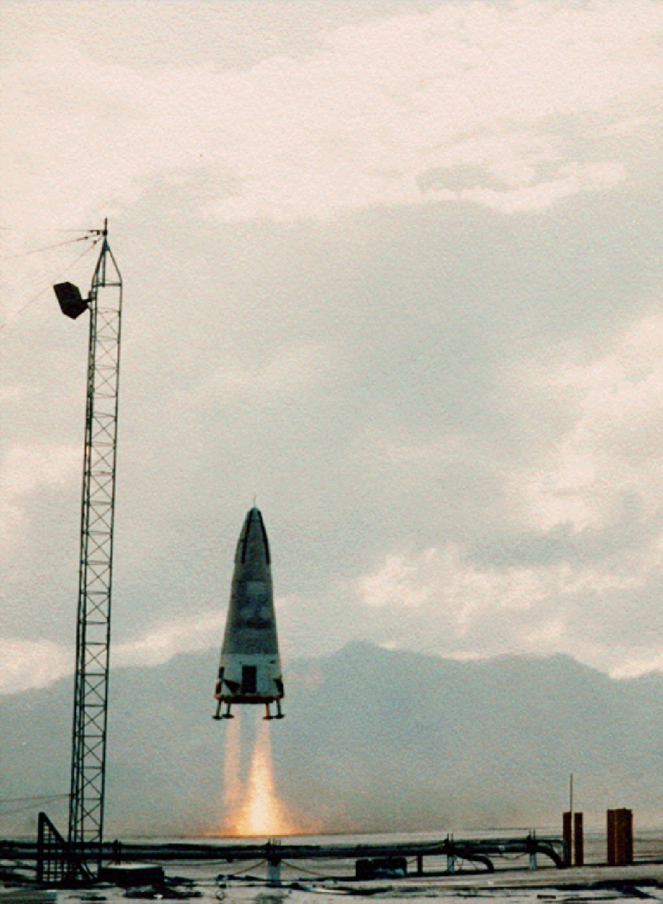
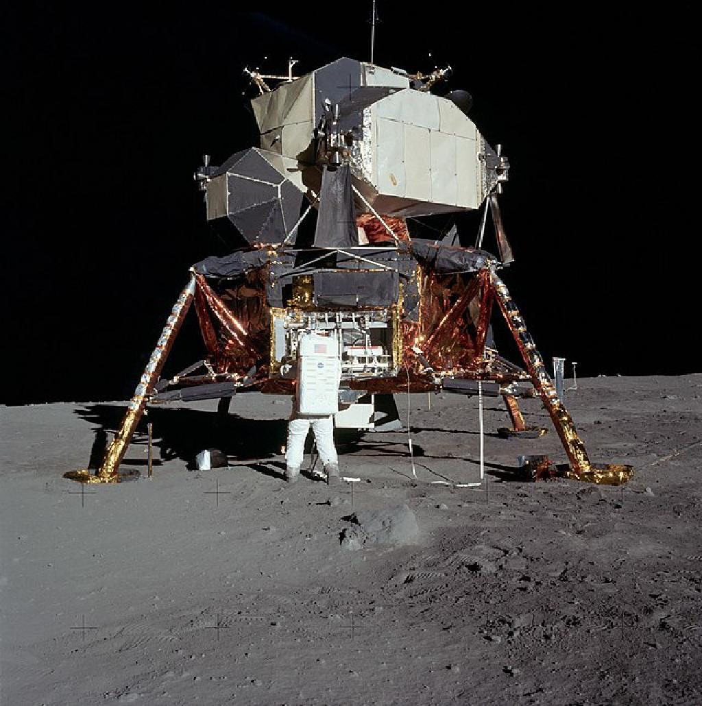

## Introduction

I’ve been a fan of spaceflight for a long time. Seeing new developments is always fun, but looking into the future (And in this case, the past too) is even more fun. Today I felt like summing up the past, future, and present of SSTO.

## Part I: What even is SSTO?

A single-stage-to-orbit (Or SSTO for short) vehicle reaches orbit from the surface of a body without expending fuel tanks, engines, or other parts. Meaning, unlike the rockets we use today, which use multiple stages to reduce weight, SSTO uses only one stage to reach orbit. The advantage to an SSTO system is that it eliminates having to re-manufacture things like boosters, fairings, and other parts for every launch like we do today. This could reduce flight cost, complexity, etc.

## Part II: History of SSTO

The SSTO concept has existed for a very long time - since the dawn of spacecraft design! during the 60s lots of concept designs for spacecraft began to emerge, and among them were lots of SSTO concepts. One of the first SSTO concepts was the expandable One stage Orbital Space Truck (OOST for short). Another early concept was the reusable vehicle NEXUS. Proposed by German engineer Krafft Arnold Ehricke, NEXUS was one of the largest spacecraft ever conceptualized with a diameter of over 50 meters. Concepts continues to emerge throughout 60s, 70s and 80s, but none of the designes actually came into fruition, Until 1991, when development of the McDonnell Douglas DC-X began. The DC-X, short for Delta Clipper Experimental, was an uncrewed, 1:3 scaled VTOL (vertical take off and landing) demo for a proposed SSTO. The plan was to later build the DC-X2 (a half scale prototype) and the DC-Y (a full scale vehicle capable of reaching orbit). Neither of these were built, but the project was taken over by NASA in 1995, and they built the DC-XA, an upgraded version of the DC-X. The vehicle was lost when it landed with only three of its four landing pads, causing it to tip over and explode. The project has since been abandoned.

## Part III: Issues with the SSTO concept

The concept of an SSTO vehicle seems amazing at first glance, but once you look deeper into it you immediately find some issues with it.

There have been various approaches to building an SSTO. Rocket-powered SSTO, Air-breathing SSTO, and even nuclear-powered designs. The main challange with Rocket-powered SSTO is achieving a high enough thrust-to-weight ratio. A rocket has to have an engine powerful enough to carry itself, its fuel, and its payload. This is very difficult to achieve on a single stage, and it is the reason why current rockets use stages - to remove redundant weight to improve the thrust-to-weight ratio. For air-breathing SSTO, not only do you have to tackle the thrust-to-weight ratio problem, you also have to tackle the complexity and research and development costs, material science and construction techniques necessary to survive extremely fast flight within the atmosphere. Another issue with SSTO tech is what engines to use. Some SSTO concepts use the same engine for all altitudes. But, because different altitudes have a different atmospheric pressures, an engine used closer to the earth would become extremely inefficient out in space.

## Part IV: The SSTOs that were built

All of the designs mentioned thus far were made to launch from earth, to reach earth orbit. Since earth has a high gravitational pull, this is quite difficult. But, other plants, such as the Moon or Mars, are way easier to launch an SSTO from. The Apollo Lunar Module, several Soviet Lunar spacecraft, and China’s Chang’e 5 Lunar ascender all ascended from the lunar surface into lunar orbit in a single stage.

## Part V: Current development

Some SSTO concepts are being worked on currently. These include the Haas rocket, which is a family of rocket space launchers developed by ARCAspace, and the Indian Avatar spacecraft, proposed by India’s Defence Research and Development Organization. But, The most promising SSTO concept being worked on right now is the Skylon. Skylon is a concept design for an SSTO by the british Reaction Engines Limited, using SABRE, a combined-cycle, air-breathing engine (the challenges with an air-breathing system were mentioned before). This project is especially interesting because testing of the key technologies was completed in 2012, allowing Skylon to move from research phase to a development phase. As of the time of writing (July 2021), the groundworks for an engine test facility have been completed at the Westcott Rocket Propulsion Facility.

## Part VI: Discussion and conclusion

We’ve learned the huge challanges and costs that come with SSTO designs, but we’ve also learned the upsides. Yet, no SSTO has ever actually flown, which brings up the question - do we even need SSTO? some new developments, like the SpaceX Starship, which aims to bring costs down to $10/kg make the promises of SSTO seem obsolete. This doesn’t make SSTOs any less fun to discuss though, so if you have anything to say be sure to join the Telegram group (https://t.me/joinchat/pfi64EYnPOJjZTA0)! I will be setting up comments inside the site for your conveinience soon, but until then I’ll keep the group open.

Thanks for reading :)

## Sources

https://en.wikipedia.org/wiki/Single-stage-to-orbit

https://en.wikipedia.org/wiki/Skylon_(spacecraft)

https://en.wikipedia.org/wiki/McDonnell_Douglas_DC-X

https://en.wikipedia.org/wiki/Haas_(rocket)

https://en.wikipedia.org/wiki/Avatar_(spacecraft)

https://en.wikipedia.org/wiki/SpaceX_Starship

https://wccftech.com/spacex-launch-costs-down-musk/
